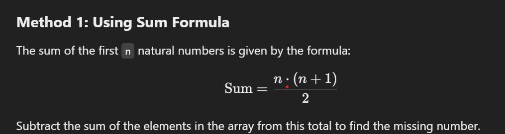

# 10 JavaScript problems

## 1. Convert Minutes to Hours and Minutes

Write a program to convert a given number of minutes into hours and minutes (e.g., `130 minutes → 2 hours and 10 minutes`).

<details>
<summary style="font-weight: bold">Answer</summary>

```js
const convertMinutesToHours = (minutes) => {
  const hours = Math.floor(minutes / 60);
  const minute = minutes % 60;
  return `${hours} hours and ${minute} minutes`;
};

console.log(convertMinutesToHours(560)); // Output: 9 hours and 20 minutes
```

</details>

---

## 2. Check if String Contains Only Digits

Create a function to check if a given string contains only numeric characters.

<details>
<summary style="font-weight: bold">Answer</summary>

### Using Regular Expression:

```js
const isNumeric = (str) => {
  return /^[0-9]+$/.test(str);
};

console.log(isNumeric("123456")); // Output: true
console.log(isNumeric("1234ab")); // Output: false
```

### Using Loop:

```js
const isNumeric1 = (str) => {
  if (str.length === 0) return false;
  for (let char of str) {
    if (char < "0" || char > "9") {
      return false;
    }
  }
  return true;
};

console.log(isNumeric1("123456")); // Output: true
console.log(isNumeric1("1234ab")); // Output: false
```

</details>

---

## 3. Generate a Random Password

Build a program to generate a random password of a specified length, including letters, numbers, and symbols.

<details>
<summary style="font-weight: bold">Answer</summary>

```js
const generateRandomPassword = (num) => {
  const letters = "abcdefghijklmnopqrstuvwxyzABCDEFGHIJKLMNOPQRSTUVWXYZ";
  const numbers = "0123456789";
  const symbols = "!@#$%^&*()_+[]{}|;:,.<>?";
  const allCharacters = letters + numbers + symbols;

  return Array.from(
    { length: num },
    () => allCharacters[Math.floor(Math.random() * allCharacters.length)]
  ).join("");
};

console.log(generateRandomPassword(14)); // Example Output: G2@b9#Ae1Yz!
```

## Using For loop

```js
const generateARandomPassword1 = (num) => {
  const letters = "abcdefghijklmnopqrstuvwxyzABCDEFGHIJKLMNOPQRSTUVWXYZ";
  const numbers = "0123456789";
  const symbols = "!@#$%^&_()_+[]{}|;:,.<>?";
  const allCharacters = letters + numbers + symbols;
  let password = "";
  for (let i = 0; i < num; i++) {
    password += allCharacters[Math.round(Math.random() * allCharacters.length)];
  }
  return `The password is ${password}`;
};
console.log(generateARandomPassword1(6));
```

</details>

---

## 4. Check if Array Contains a Target Element

Write a function to check if a specific value exists in an array.

<details>
<summary style="font-weight: bold">Answer</summary>

### Using `includes()`:

```js
const containsElement = (arr, target) => arr.includes(target);

console.log(containsElement([1, 2, 3, 4], 3)); // Output: true
console.log(containsElement([1, 2, 3, 4], 5)); // Output: false
```

### Using Loop:

```js
const containsElement1 = (arr, target) => {
  for (let ele of arr) {
    if (ele === target) return true;
  }
  return false;
};

console.log(containsElement1([1, 2, 3, 4], 3)); // Output: true
console.log(containsElement1([1, 2, 3, 4], 5)); // Output: false
```

## Using `indexOf()`

```js
const containsElement1 = (arr, target) => {
  return arr.indexOf(target) !== -1;
};
console.log(containsElement1([1, 2, 3, 4], 3)); // Output: true
console.log(containsElement1([1, 2, 3, 4], 5)); // Output: false
```

## Using `some()`

```js
const containsElement4 = (arr, target) => {
  return arr.some((a) => a === target);
};
console.log(containsElement4([1, 2, 3, 4], 5)); // Output: false
```

</details>

---

## 5. Flatten a Nested Array

Create a program to flatten a nested array (e.g., `[1, [2, [3, 4]]] → [1, 2, 3, 4]`).

<details>
<summary style="font-weight: bold">Answer</summary>

### Using Recursion:

```js
const flattenArray = (arr) => {
  return arr.reduce((flat, item) => {
    return flat.concat(Array.isArray(item) ? flattenArray(item) : item);
  }, []);
};

console.log(flattenArray([1, [2, [3, 4]]])); // Output: [1, 2, 3, 4]
```

## using `reduce()`

```js
const FlattenNestedArray = (arr) => {
  return arr.reduce((single, nestedArray) => {
    return single.concat(
      Array.isArray(nestedArray) ? FlattenNestedArray(nestedArray) : nestedArray
    );
  }, []);
};
console.log(FlattenNestedArray([1, [2, [3, 4]]]));
```

</details>

---

## 6. Find the Intersection of Two Arrays

Write a function that returns the common elements between two arrays.

<details>
<summary style="font-weight: bold">Answer</summary>

## using `filter()`

```js
const findIntersection = (arr1, arr2) => {
  return arr1.filter((element) => arr2.includes(element));
};

console.log(findIntersection([1, 2, 3], [2, 3, 4])); // Output: [2, 3]
```

## using for loop

```js
const commonElementsBetweenTwo = (arr1, arr2) => {
  let arrElement = [];
  for (let i = 0; i < arr1.length; i++) {
    if (arr2.includes(arr1[i]) && !arrElement.includes(arr1[i])) {
      arrElement.push(arr1[i]);
    }
  }
  return arrElement;
};
```

</details>

---

## 7. Find Missing Number in an Array

Given an array of numbers from `1` to `n` with one number missing, find the missing number (e.g., `[1, 2, 4, 5] → 3`).

<details>
<summary style="font-weight: bold">Answer</summary>
 
 ## using formula
 

```js
const findMissingNumber = (arr) => {
  const n = arr.length + 1;
  const totalSum = (n * (n + 1)) / 2;
  const actualSum = arr.reduce((sum, num) => sum + num, 0);
  return totalSum - actualSum;
};

console.log(findMissingNumber([1, 2, 3, 5])); // Output: 4
```

### using XOR Operator ^

The XOR operator (^) can be used to find the missing number. XOR of two identical numbers is 0, and XOR of a number with 0 is the number itself.

```js
const findMissingNumber1 = (arr) => {
  let n = arr.length + 1;
  let XORall = -Infinity;
  let XORarray = -Infinity;

  for (let i = 1; i <= n; i++) {
    XORall ^= i;
  }
  for (let num of arr) {
    XORarray ^= num;
  }
  return XORall ^ XORarray;
};
console.log(findMissingNumber1([1, 2, 3, 4, 5, 6, 8, 9]));
```

</details>

---

## 8. Check for Balanced Parentheses

Write a function to check if a string has balanced parentheses (e.g., `"(a+b)"` is balanced, `"(a+b))"` is not).

<details>
<summary style="font-weight: bold">Answer</summary>

```js
const isBalanced = (str) => {
  let count = 0;
  for (let char of str) {
    if (char === "(") count++;
    if (char === ")") count--;
    if (count < 0) return false;
  }
  return count === 0;
};

console.log(isBalanced("(a+b)")); // Output: true
console.log(isBalanced("(a+b))")); // Output: false
```

</details>

---

## 9. Calculate GCD (Greatest Common Divisor)

Create a program to find the greatest common divisor of two numbers.

<details>
<summary style="font-weight: bold">Answer</summary>

### Using Loop:

```js
const findGCD = (a, b) => {
  a = Math.abs(a);
  b = Math.abs(b);
  while (b !== 0) {
    [a, b] = [b, a % b];
  }
  return a;
};

console.log(findGCD(56, 98)); // Output: 14
```

### Using Recursion:

```js
const findGCDRecursion = (a, b) => {
  if (b === 0) return a;
  return findGCDRecursion(b, a % b);
};

console.log(findGCDRecursion(48, 18)); // Output: 6
```

</details>

---

## 10. Count Words Starting with a Specific Letter

Build a function to count the number of words in a sentence that start with a given letter.

<details>
<summary style="font-weight: bold">Answer</summary>

### Using `filter()`:

```js
const countWordsWithLetter = (str, letter) => {
  const target = letter.toLowerCase();
  return str.split(" ").filter((word) => word[0]?.toLowerCase() === target)
    .length;
};

console.log(countWordsWithLetter("nagakumar makes rice in a maker", "m")); // Output: 3
```

### Using Loop:

```js
const countWordsWithLetter1 = (str, letter) => {
  const target = letter.toLowerCase();
  let count = 0;
  for (let word of str.split(" ")) {
    if (word[0]?.toLowerCase() === target) count++;
  }
  return count;
};

console.log(countWordsWithLetter1("This is a test sentence", "t")); // Output: 2
```

</details>
